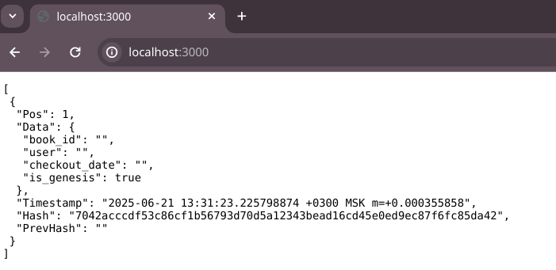

# Реализация простого блокчейна для книг

Для маршрутизации http-запросов использолвана библиотека (github.com/gorilla/mux)[github.com/gorilla/mux] 

Имеется блокчейн который является массивом из блоков. Через HTTP-запросы происходит добавление новых блоков в блокчейн 
с генерацией и валидацией блоков

